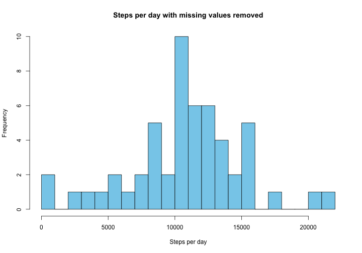
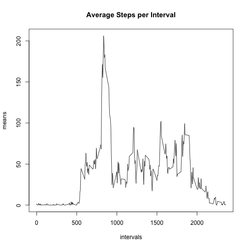
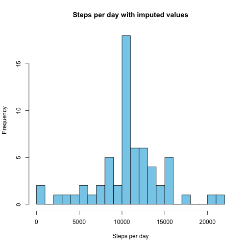
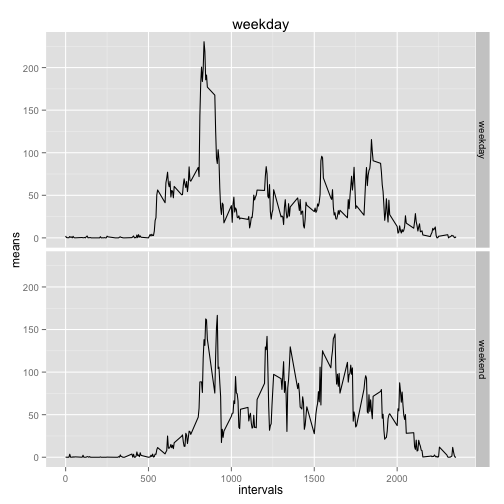

# Reproducible Research: Peer Assessment 1


## Loading and preprocessing the data

```r
# Load data and make list of unique intervals, unique dates and unique dates that have at least one non-NA value
activity.data <- read.csv('activity.csv')
intervals <- sort(unique(activity.data$interval))
dates <- unique(as.character(activity.data$date))
dates.without_NA <- unique(as.character(activity.data[!is.na(activity.data$steps),]$date))
```


## What is mean total number of steps taken per day?

```r
# Calculate the number of steps per day, ignoring days that have steps = NA for all intervals
steps <- sapply(dates.without_NA, function(x) sum(activity.data[activity.data$date == x,]$steps, na.rm=TRUE))
 
hist(steps, 
     breaks=25,
     main="Steps per day with missing values removed",
     xlab="Steps per day",     
     col="skyblue")
```

 

```r
mean(steps)
```

```
## [1] 10766.19
```

```r
median(steps)
```

```
## [1] 10765
```


## What is the average daily activity pattern?


```r
means <- sapply(intervals, function(x) mean(activity.data[activity.data$interval == x,]$steps, na.rm=TRUE))
plot(intervals, 
     means,
     main="Average Steps per Interval",
     type="l")
```

 

```r
intervals[which.max(means)]
```

```
## [1] 835
```

We can see from the plot that the mean steps is very low until about 5:30 where it rises until it reaches the max at 8:35. For the rest of the day, the means vary between approximately 20 and 100 until 
aroung 9:30 then the average starts falling to zero.

## Imputing missing values

```r
#Calculate and report the total number of missing values in the dataset
sum(as.numeric(is.na(activity.data$steps)))
```

```
## [1] 2304
```

```r
#fill in NAs with mean for that 5 min interval
interval.means <- data.frame(interval=intervals, mean=means)
impute_steps <- function(x,y) if (is.na(x)) interval.means[interval.means$interval == y,"mean"] else x

imputed_steps <- mapply(impute_steps, activity.data$steps, activity.data$interval)

activity.imputed <- data.frame(steps=imputed_steps, date=activity.data$date, interval=activity.data$interval)

steps.imputed <- sapply(dates, function(x) sum(activity.imputed[activity.imputed$date == x,]$steps))

hist(steps.imputed,
     main="Steps per day with imputed values",
     xlab="Steps per day",
     breaks=25,
     col="skyblue")
```

 

```r
mean(steps.imputed)
```

```
## [1] 10766.19
```

```r
median(steps.imputed)
```

```
## [1] 10766.19
```

I replaced the missing step values with the mean steps for that interval. This produced a daily mean that was identical to the mean calculated with the NA values removed. This is expected based on the following:

$\Large \text{Given: } \bar{x} = \frac{1}{n} \sum_{i=1}^n x_i$

$\Large \frac{1}{n + m}[x_1+x_2+\dots+x_n+\sum_{j=1}^m \bar{x}]$

$\Large = \frac{1}{n + m}[\sum_{i=1}^n x_i + \sum_{j=1}^m \bar{x}]$

$\Large = \frac{1}{n + m}[n\bar{x} + m\bar{x}]$

$\Large = \bar{x}$

The median has the same value which is also expected since there are eight days that have NA for each interval. This means that all eight will have a daily mean of the overall daily mean. 

## Are there differences in activity patterns between weekdays and weekends?


```r
day_of_week <- weekdays(as.Date(activity.imputed$date))
     
day <- as.factor(sapply((day_of_week != "Sunday" & day_of_week != "Saturday"), function(x) if (x) "weekday" else "weekend"))

activity.imputed <- cbind(activity.imputed, day)

means.weekday <- sapply(intervals, function(x) mean(activity.imputed[activity.imputed$interval == x & activity.imputed$day == 'weekday',]$steps))
means.weekend <- sapply(intervals, function(x) mean(activity.imputed[activity.imputed$interval == x & activity.imputed$day == 'weekend',]$steps))

interval_means <- data.frame(interval=rep(intervals, times=2), means=append(means.weekday, means.weekend), day=as.factor(rep(c("weekday", "weekend"), each=length(intervals))))

library(ggplot2)
```

```
## Warning: package 'ggplot2' was built under R version 3.1.3
```

```r
p <- ggplot(interval_means, aes(interval, means)) + facet_grid(day ~ .) +
    labs(title="weekday", x="intervals", y="means") 
p + geom_line()
```

 

Based on the plot, there seems to be differences in steps per interval on weekdays vs. weekends. On the weekdays, there is peak activity around 8:30 and less activity for the rest of the day. On weekends, the activity also peaks in the morning, but activity is more evenly spread out over the course of the day. 


